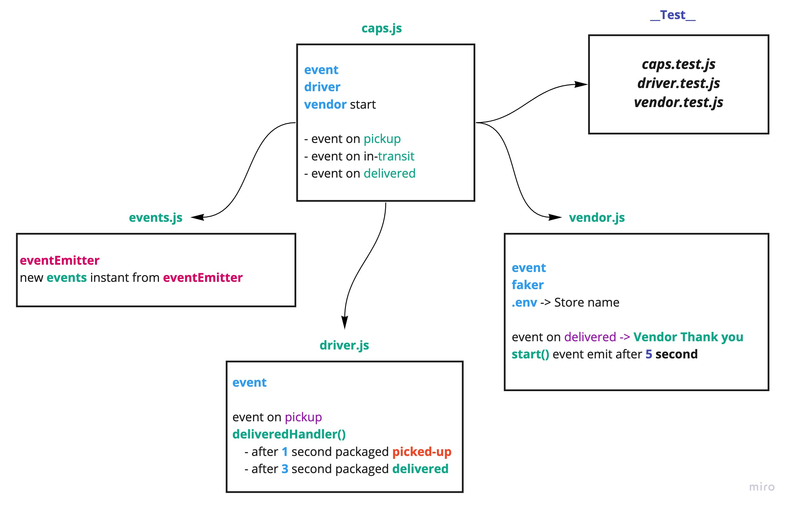

# caps

CAPS Phase 1: Begin the build of an application for a company called CAPS - The Code Academy Parcel Service. In this sprint, we’ll build out a system that emulates a real world supply chain. 
CAPS will simulate a delivery service where vendors (such a Cacti shops) will ship products using our delivery service and when our drivers deliver them, be notified that their customers received what they purchased.


### modules
- `caps.js`
- `vendor.js`
- `events.js`
- `driver.js`

### Packages
- `faker`
- `jest`

#### How to initialize/run your application (where applicable)
- `node caps.js`

Script will start after 5 second and get data as below

```
EVENT { 
    event: 'pickup',
    time: 2020-03-06T18:27:17.732Z,
    payload:
    { 
        store: '1-206-flowers',
        orderID: 'e3669048-7313-427b-b6cc-74010ca1f8f0',
        customer: 'Jamal Braun',
        address: 'Schmittfort, LA' 
    } 
}
DRIVER: picked up e3669048-7313-427b-b6cc-74010ca1f8f0
EVENT { 
    event: 'in-transit',
    time: 2020-03-06T18:27:18.738Z,
    payload:
    { 
        store: '1-206-flowers',
        orderID: 'e3669048-7313-427b-b6cc-74010ca1f8f0',
        customer: 'Jamal Braun',
        address: 'Schmittfort, LA' 
    } 
}
DRIVER: delivered up e3669048-7313-427b-b6cc-74010ca1f8f0
VENDOR: Thank you for delivering e3669048-7313-427b-b6cc-74010ca1f8f0
EVENT { 
    event: 'delivered',
    time: 2020-03-06T18:27:20.736Z,
    payload:
    { 
        store: '1-206-flowers',
        orderID: 'e3669048-7313-427b-b6cc-74010ca1f8f0',
        customer: 'Jamal Braun',
        address: 'Schmittfort, LA' 
    } 
}
```

#### Tests
- `npm run test`

#### UML


