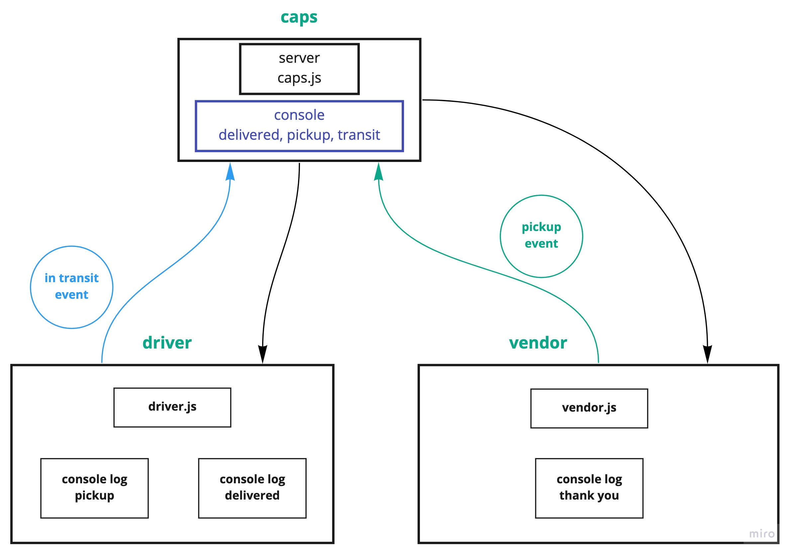

# caps

In Phase 2, we’ll be spreading the functionality of our CAPS application into multiple applications, so that users on different computers and connections can continue to communicate in real time as packages are prepared, picked up, and delivered.

CAPS will simulate a delivery service where vendors (such a Cacti shops) will ship products using our delivery service and when our drivers deliver them, be notified that their customers received what they purchased.


### modules
- caps
   - `caps.js`
   - `package.json`
- vendor
   - `vendor.js`
   - `package.json`
- driver
   - `driver.js`
   - `package.json`

### Packages
- `faker`
- `jest`
- `dotenv`

#### How to initialize/run your application (where applicable)
1. first start the cap server
   - `cd ~/repo/caps`
   - `node caps.js`
2. then go to vendor folder
   - `cd ~/repo/vendor`
   - `node vendor.js`
3. then go to driver
   - `cd ~/repo/driver`
   - `node driver.js`

### Setup
`.env` requirements
```
/caps/.env
PORT=3000
```
/driver/`.env`
```
PORT=3000
HOST= localhost
```

/vendor/`.env`
```
PORT=3000
HOST=localhost
STORE_NAME=Cacti Store
```


**Script will start after 5 second and get data as below**

```
// Caps server
EVENT {
  event: 'pickup',
  time: 'Mon, 28 Sep 2020 18:25:51 GMT',
  payload: {
    store: 'Cacti Store',
    orderID: 'c5e3db7e-417a-4d82-b96d-e463ac5536a8',
    customer: 'Yoshiko Hodkiewicz',
    address: '194 Collins Landing'
  }
}
EVENT {
  event: 'in transit',
  time: 'Mon, 28 Sep 2020 18:25:52 GMT',
  payload: {
    store: 'Cacti Store',
    orderID: 'c5e3db7e-417a-4d82-b96d-e463ac5536a8',
    customer: 'Yoshiko Hodkiewicz',
    address: '194 Collins Landing'
  }
}
EVENT {
  event: 'delivered',
  time: 'Mon, 28 Sep 2020 18:25:54 GMT',
  payload: {
    store: 'Cacti Store',
    orderID: 'c5e3db7e-417a-4d82-b96d-e463ac5536a8',
    customer: 'Yoshiko Hodkiewicz',
    address: '194 Collins Landing'
  }
}
```

```
// Driver
pickup e196d124-3dee-4ac2-8ed0-991db1165d2b
delivered e196d124-3dee-4ac2-8ed0-991db1165d2b
pickup e1c2a46f-11d3-4a7c-8101-f50a5fddaede
delivered e1c2a46f-11d3-4a7c-8101-f50a5fddaede
pickup e483e000-3c4a-47ab-b8a9-e5927b6624d2
delivered e483e000-3c4a-47ab-b8a9-e5927b6624d2
pickup 2189189b-d450-46da-aea2-e4927a324409
delivered 2189189b-d450-46da-aea2-e4927a324409
pickup 2a53169e-586b-4d48-9c32-1ff9955a71f2
```

```
// Vendor
VENDOR: Thank you for delivering 277c1042-4be4-477b-bf42-c2e1026cee11
VENDOR: Thank you for delivering 193c6c8f-7483-411a-b42c-561ba1e15da0
VENDOR: Thank you for delivering d4471714-2cac-48cf-8f41-665745a5093d
VENDOR: Thank you for delivering 4df156c4-ba5a-46fa-bea3-5b48bc8259a5
VENDOR: Thank you for delivering 5fc05896-d742-4dd2-89c8-95a145f6acca
VENDOR: Thank you for delivering 9c4a93e1-a8d8-4a12-ae4d-bcaf4830564c
VENDOR: Thank you for delivering 001216c2-84ea-4515-94c0-47605915638e
```

#### Tests
- `npm run test`

#### UML


